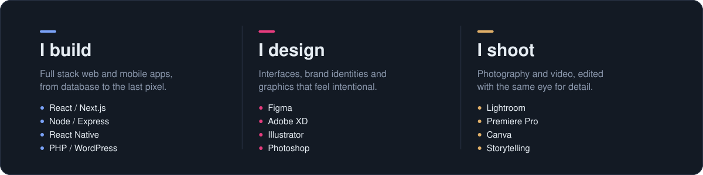
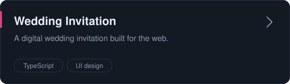
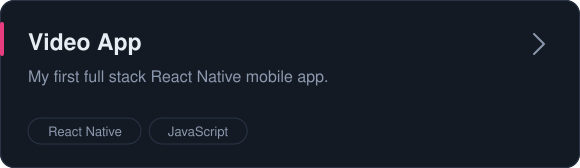

  
  <!-- TODO: replace your-link -->
  
  

  <a href="#toolbox"><kbd>&nbsp;Toolbox&nbsp;</kbd></a>
  <a href="#selected-work"><kbd>&nbsp;Work&nbsp;</kbd></a>
  <a href="#on-github"><kbd>&nbsp;GitHub&nbsp;</kbd></a>
  <a href="#lets-talk"><kbd>&nbsp;Contact&nbsp;</kbd></a>

 

I'm a developer who designs and a designer who codes. I build full stack web and mobile apps with React, Next.js and Node, and I design the interfaces, brands and graphics that sit on top of them. Behind the camera, I shoot and edit photos and video. I care about how a product works and how it feels, in equal measure.

> **Now** &nbsp;·&nbsp; going deeper into Next.js, motion and design systems.

 

## Toolbox

  
<b>Development</b>

   
  

  
<b>Data and tooling</b>

   
  

  
<b>Design and media</b>

   
  

## Selected work

  
  
  
  
  
  

Design work lives in [Graphics](https://github.com/harsha-99-tech/Graphics) and on my [portfolio](https://harsha-nawana.pages.dev).

## On GitHub

  
  

  
Contribution snake

   
  <picture>
    <source media="(prefers-color-scheme: dark)" srcset="https://raw.githubusercontent.com/harsha-99-tech/harsha-99-tech/output/github-contribution-grid-snake-dark.svg">
    
  </picture>

## Let's talk

Have a project, a collaboration or a shoot in mind? [Say hello](mailto:harshanawana@gmail.com) or take a look at the [portfolio](https://harsha-nawana.pages.dev).

 

